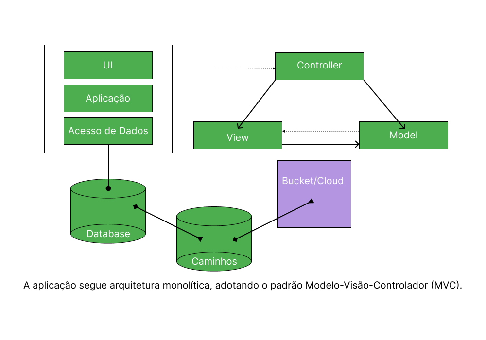
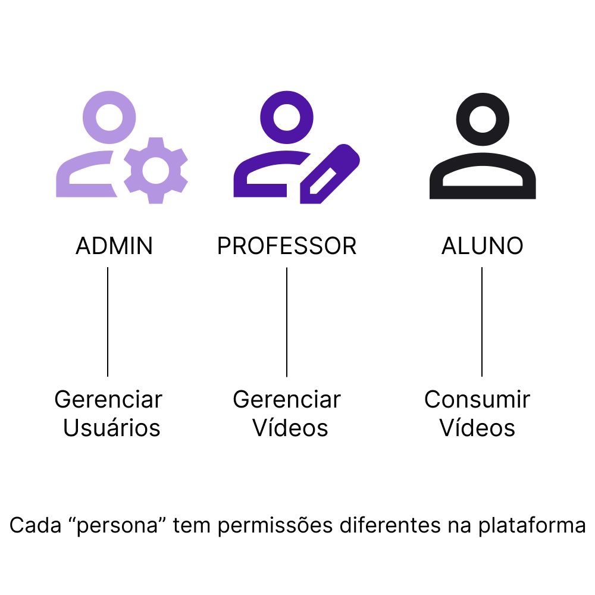
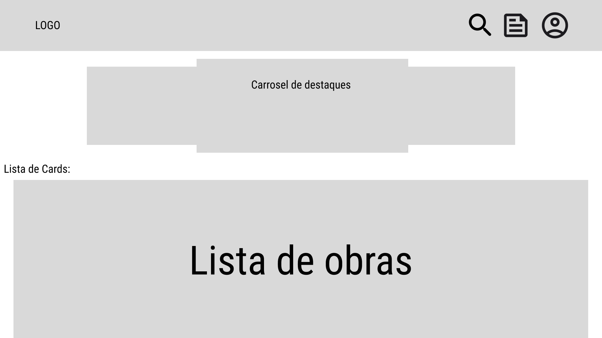
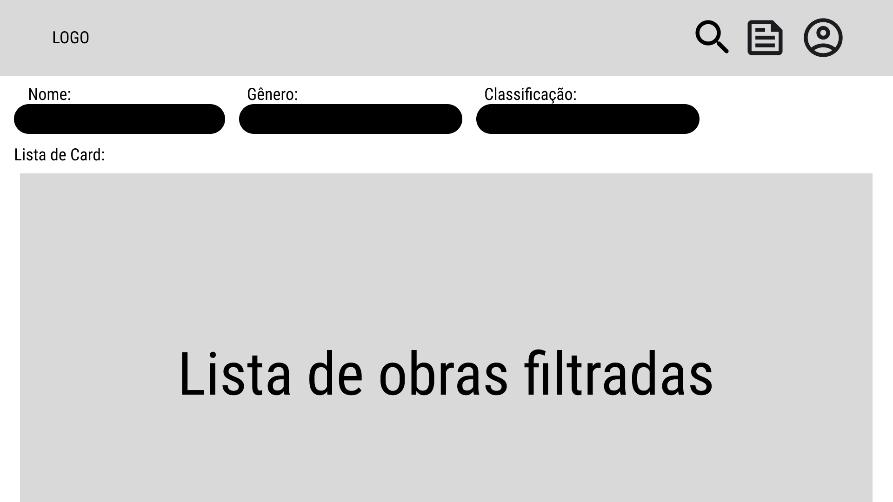
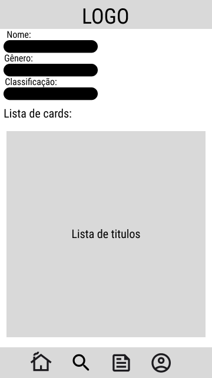
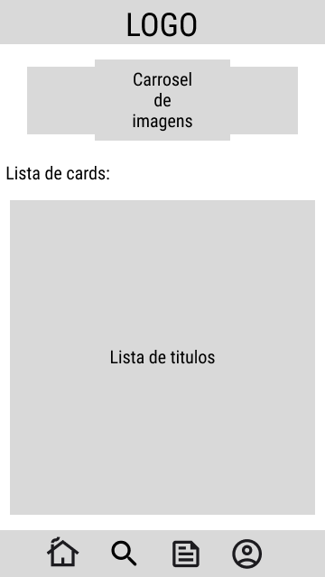

## Arquitetura
A Aplicação é monolítica com arquitetura MVC no backend.

A aplicação segue a arquitetura monolítica, adotando o padrão Modelo-Visão-Controlador (MVC). Onde temos uma interface que chama a aplicação rodando em formato de **API REST**.
A API chama uma database que contém informações sobre os vídeos, logo, catalogando todos os vídeos disponíveis. Quando o usuário clica sobre o "Card de vídeo" é chamado uma outra base de dados que carrega o caminho e informações adicionais do conteúdo, além de reproduzir um vídeo carregado diretamente do Google Cloud Storage que esta contido em um bucket. 

# Modelo de usuários

## Padrões de interface

Esses padrões são desenvolvidos com base em princípios de usabilidade, acessibilidade, experiência do usuário e design centrado no usuário.

**1.** Tipografía (Typography): Inter

**2.** Paleta de cores: ##b495e2 - Roxo Neon, #white - Branco para cor de destaque

**3.** Barra de Navegação (Navbar): A barra de navegação contém links para as principais seções do site.

**4.** Botão de Busca: Permite aos usuários procurar por conteúdo específico dentro da plataforma.

**5.** Cards: Elementos retangulares que contêm informações sobre as obras audiovisuais.

**6.** Caixas de Modais (Modais): Caixas que aparecem sobre a página que auxiliam na navegação.

|Modais|
|------------------|
|Feedback de Estado (Status Feedback): Informa aos usuários sobre o estado atual da aplicação, como mensagens de sucesso, erro, ou alertas.|
|Feedback Visual (Visual Feedback): Indicadores visuais sobre o resultado de uma ação: Barra de carregamento.|
|Botões de Ação (Action Buttons): Botões que iniciam uma ação específica, como "Enviar", "Salvar", "Editar", etc.|

**7.** Ícones: Representações visuais que facilitam a identificação da função: símbolo de lupa para indicar o botão de pesquisa.

**8.** Animações e Transições: Movimentos que fornecem feedback visual: animação ao colocar o mouse acima do botão.

## Modalidades de interações

A modalidade de interações de um site se refere aos diferentes tipos de ações ou atividades que os usuários podem realizar ao interagir com o site. Essas interações podem ser variadas e incluem coisas como clicar em links, preencher formulários, fazer compras, assistir a vídeos, fazer comentários, compartilhar conteúdo em redes sociais, entre outras atividades.

**1.** Navegação: Os usuários podem clicar em links ou botões para navegar entre as páginas do site.

**2.** Interação com Mídia: Podem interagir com as mídias de vídeos do site: Controle de volume, pausar, retroceder e adiantar as mídias.

**3.** Comentários e Feedback: Os usuários podem deixar comentários nas obras em que assistirem.

**4.** Autenticação e Perfil do Usuário: Os usuários devem fazer login para acessar o conteúdo da plataforma.

**5.** Busca e Filtragem: Os usuários podem utilizar uma aba de busca para encontrar conteúdo específico ou aplicar filtros para refinar os resultados.

# Design de interface

**1.** Familiaridade do usuário:  A interface deve usar termos e conceitos extraídos das experiências das pessoas que devem usar o software.                
   Terminologia: Usaremos termos que sejam familiares para o público-alvo. Como exemplo, como o projeto WEB/SITE é destinado inserção de vídeos e visualização, usaremos termos como “assistir”, “inserir”, “pesquisar” e “comentar vídeo”. Faremos uma pesquisa no site do IFB, buscando informações e perfis nos textos etc.   

**2.** Consistência: A interface será consistente e suas operações sejam ativadas da mesma maneira se tem mesma função.
   Botões de Ação: Nós tornaremos padronizado os botões isso em pesquisa no Site do IFB, se tem um botão “Salvar” em uma parte do software/site para salvar as informações inseridas pelo usuário, usaremos o mesmo termo “Salvar” em todas as partes do software/site onde a mesma ação precisa ser realizada. Não usar termos diferentes como “Incluir” ou “Finalizar” para a mesma ação de salvar.   

**3.** Surpresa mínima:  O site deve apresentar comportamento esperado pelo usuário.
   Mensagens de Confirmação: Se o software/site exibir a mensagem de “Inclusão bem-sucedida!” após o usuário incluir algo, então o site deve mostrar essa mesma mensagem sempre que a inclusão for bem-sucedida.    

**4.** Orientação do usuário: Terá no site o feedback significativo quando ocorrerem erros e devem ser fornecidas informações.
   Feedback de Erro: Quando um usuário cometer um erro, como deixar campos obrigatórios em branco em um formulário, a interface deverá/apresentará fornecer feedback claro e imediato. Como os campos que precisam ser preenchidos podem ser destacados em vermelho e uma mensagem pode aparecer informando ao usuário quais campos precisam ser preenchidos e quais informações.   

