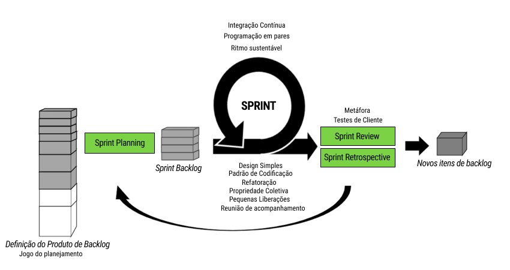

# Processo de desenvolvimento de software
Em nossa metodologia de desenvolvimento foi escolhido as técnicas do XP e as cerimônias do Scrum.

## Práticas do Scrum que serão aplicadas

- **Reunião de acompanhamento**: A equipe vai se reunir 2x por semana.
- **Sprint Planning**: Reunião realizada no inicio de cada sprint, para definir os itens do backlog que serão desenvolvidos na sprint.
- **Sprint Restrospective**: Reunião realizada com objetivo de refletir sobre o que foi feito na sprint passada e então  identificar possíveis melhoras.
- **Sprint Review**: Reunião para revisar todos os itens do backlog que foram concluídos de acordo com as definição de preparado e pronto, com participação de clientes.
- **Product Backlog**:  Lista de histórias priorizadas que precisam ser desenvolvidos para atender aos objetivos do projeto.

## Práticas do XP que serão aplicadas

### No nível de programação

- **Programação em Pares:** Acreditamos que a programação em pares ajudará a manter a ideia de “Propriedade coletiva”, além de ajudar os membros a trocar conhecimentos e debater ideias sobre a construção do projeto.
- **Refatoração:** É uma prática agregadora, que traz qualidade e gratificação e eficiência tanto para o cliente quanto para a equipe, para entregar um produto de qualidade e inovador.
- **Design Simples:** O design simples é um dos valores mais importantes para a equipe, pois acreditamos que simplicidade junta com uma documentação abrangente agrega muito mais valor que um produto complexo e nada intuitivo.
- **Padrão de Codificação:** O padrão de codificação se baseia na boa estrutura de código, além de usar princípios do clean code como bom nomes para variáveis e a criação de um código legível para qualquer dev.

### No nível de equipe

- **Propriedade Coletiva:** Acreditamos que essa prática seja muito boa para a equipe, pois minimiza o risco de dependência de um membro sobre alguma função.

### No nível de processo

- **Ritmo Sustentável:** Achamos importante que a equipe maximize seu tempo, de uma forma que não seja prejudicial.
- **Integração Contínua:** Acreditamos que a integração contínua ajuda a todo a equipe, pois teremos em tempo de horas as contribuições de cada membro da equipe.
- **Pequenas Liberações:** Acreditamos que o feedback do cliente ajudará bastante, e a equipe decidiu compartilhar pequenas liberações com o cliente.
- **Jogo do Planejamento:** Utilizaremos o jogo do planejamento para definir com o cliente os produtos de backlog e descrever as histórias de usuário
- **Metáfora:** Acreditamos que a criação de uma metáfora pode ser difícil, especialmente considerando que a aplicação não se encaixa bem em uma metáfora. Também consideramos que o cliente escolhido também é um dev, logo a metáfora deixa de ser tão necessária na relação Equipe Scrum e PO.
- **Testes de cliente:** Devido a dificuldades de horários, não será possível implementar a prática de toda a equipe. No entanto, vamos buscar formas de colaboração e integração em níveis menores, garantindo que todos possam contribuir para o sucesso do projeto.

## Práticas do XP que não serão aplicadas

- **Desenvolvimento Dirigido por Testes:** Ao analisamos o projeto ao todo, refletimos que é inviável desenvolver por DDT, pois precisaríamos de tempo para aprender esse paradigma, além de consumir um tempo que pode ser direcionado a outros núcleos

## Histórico de revisão

|   Data   | Versão | Descrição                                        | Autor           |
|:--------:| :----: | ------------------------------------------------ | --------------- |
| 21/09/23 |  1.0   | Criação da documentação                          | Todos           |