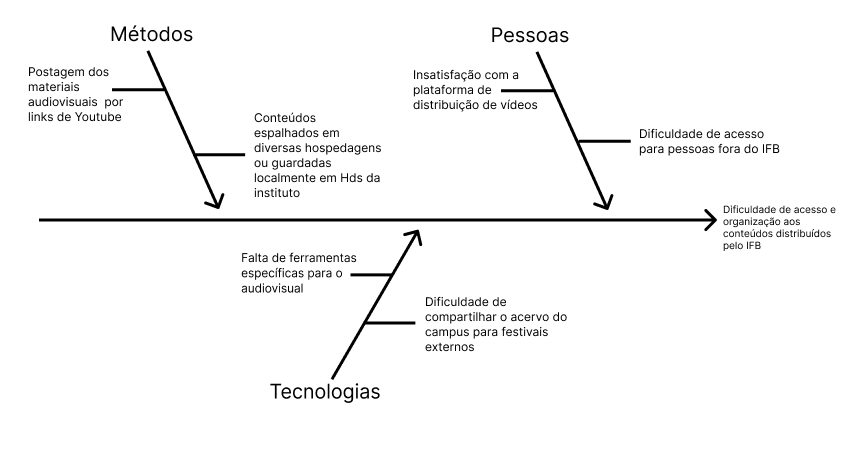

# Visão do Produto

## Histórico de Revisão
| Data  | Versão | Descrição | Autor |
| ---   | ------ | --------- | ----- |
| 20/09 |  1.1   | Primeira versão do documento | Todos |
| 25/10 |  1.2   | Segunda versão do documento  | Todos |

## Declaração de Posição do produto
O produto proposto é um aplicação WEB, com extensão também no formato mobile para celulares Android e IOS que funciona como um acervo de conteúdo audiovisual, além de ser possível que os estudantes façam upload de seus próprios vídeos profissionais a pedido ao administrador. ​

A aplicação além do acervo vai ter funcionalidades voltada para o mundo do audiovisual, como um lugar para postar críticas especializadas sobre as próprias obras postadas pelos alunos. ​

Os usuários são principalmente estudantes do IFB, mas também toda a comunidade interessada em filmes e vídeos voltados ao cinema, que logo terão uma forma mais simples e direto de acesso por meio de seu celular.

| Para          | Professores e Alunos do Curso Audiovisual do IFB                                               |
| ----          | ---------------------------------------------------------------------------------------------- |
| Quem | Os professores conseguirem armazenar e catalogar as produções e os alunos distribuir de forma simples.  |
| O Emaflix     | É uma aplicação web com porte para mobile.                                                     |
| Que           | Armazena, cataloga e distribui as produções em uma unica plataforma facilitando o acesso       |
| Ao contrario  | Do youtube.                                                                                    |
| Nosso produto | Centraliza a distribuição dos videos do IFB, contendo todo o acervo em um unico espaço e facilitando a busca. |

## Objetivo do Produto

### Objetivo Geral 

Nosso objetivo é implementar um sistema eficiente de organização ao acesso às obras cinematográficas produzidas e disponibilizadas pelo IFB, através da consolidação dessas produções em uma única plataforma.

### Objetivos especificos

Melhorar a visualização do acervo de conteúdos da instituição.
Ajudar na visibilidade das obras criadas pelos estudantes.

## Tecnologias a Serem Utilizadas 

**Plataforma:** Aplicação Web com layout mobile rensposível.

A aplicação suportar os seguintes navegadores:

|Navegador| Versão |
|---------|--------|
| Firefox Browser| Versão: 118.0.2 (64 bits)|
| Google Chrome  | Versão: 118.0.5993.89 (64 bits)|
| Microsoft Edge | Versão: 118.0.2088.57 (64 bits)|

**React:** Será a biblioteca de JavaScript utilizada para construir as interfaces de usuário (UI) interativas e dinâmicas para aplicações web.

**Java:** Será utilizado para construir as API que requisitadas pelas interfaces por meio de protocolos UDP ligadas ao servidores locais disponibilizados pelo IFB.

**Jest/Git actions:** Utilizando o framework Jest para:

|Teste | Ação |
|------|------|
| Testes de unidades | Verificar o funciomento de códigos individualmente |
| Teste de integração| Verificar o funciomento de códigos em conjuntos a outros|
| Teste de componentes React | Verificar o funciomento de componentes do react, como tempo de renderização ou ação de seus estados |
| Teste de Funções assíncronas | Verificar o funcionamento de chamadas assíncronas da API |

**Portabilidade para celular:** Baseada na lista de telas padronizadas fornecida pelo Android Developers, a portabilidade garantida será de:  

1. **600 px >= largura =< 840 px**
2. **480 px >= altura =< 900 px**

Lista de telas fornecida pelo Android Develops:

| Classe de Tamanho | Pontos de interrupção | Representação do dispositivos |
|-------------------|-----------------------|-------------------------------|
|Largura compacta    | < 600 dp | 99,96% dos smartphones no modo retrato
|Largura média|600 dp+| 93,73% dos tablets no modo retrato |
|Largura expandida | Largura expandida| 97,22% dos tablets no modo paisagem|
| Altura compacta  | < 480 dp | 99,78% dos smartphones no modo paisagem|
|Altura média | 480 dp+ | 96,56% dos tablets no modo paisagem  e 97,59% de smartphones no modo retrato|
|Altura expandida|900 dp+|94,25% de tablets no modo retrato|

